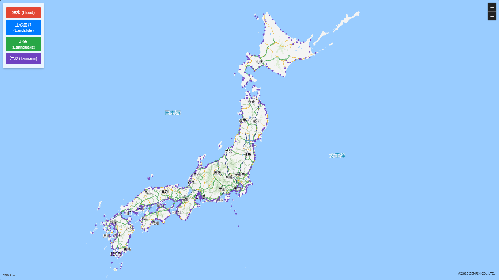

# ZENRIN Maps API の住宅地図にハザードマップを重畳してみた

## 概要

本記事では、ZENRIN Maps API の地図 API を使用してハザードマップ（洪水・土砂災害・地震・津波）を実装する方法を解説します。各ハザードの情報を JSON ファイルから取得し、地図上にオーバーレイとして表示できるようにします。また、指定した地域の緯度・経度情報を活用し、地図にハザード情報を適切に表示する機能を追加します。

### 📌 緯度・経度による地図表示：

地図上に各市町村をピン表示し、リンク先に遷移することが可能です。

### 📌 ポップアップ機能

各ポイントをクリックすることで、該当するハザードマップの詳細 URL を表示するポップアップが表示されます。

### 📖 出典

本記事で使用するハザードデータは[ハザードマップポータルサイト](https://disaportal.gsi.go.jp/hazardmapportal/hazardmap/copyright/copyright.html)より取得した公共データを基にしています。

※本データは「公共データ利用規約（PDL1.0）」のもとで提供されており、再配布・改変が可能です。

「ハザードマップ」のリンク先のダウンロード[最新データ](https://disaportal.gsi.go.jp/hazardmapportal/hazardmap/copyright/opendata.html#wagamachi)

### 📥 ダウンロードした CSV データ形式（元データ）

```csv
市町村コード,都道府県,市町村,掲載するURL
1100,北海道,札幌市,https://www.city.sapporo.jp/kikikanri/higoro/jisin/jbmap.html
1202,北海道,函館市,https://www.hazardmap.city.hakodate.hokkaido.jp/
1203,北海道,小樽市,https://www.city.otaru.lg.jp/docs/2020100500413/
1204,北海道,旭川市,https://www.city.asahikawa.hokkaido.jp/500/522/53901/5439010/p003979.html
1206,北海道,釧路市,https://www.city.kushiro.lg.jp/kurashi/bousai/1003697/index.html
1207,北海道,帯広市,https://www.city.obihiro.hokkaido.jp/shisei/seisaku/jyutaku/1003439.html
1208,北海道,北見市,https://www.city.kitami.lg.jp/administration/disaster/detail.php?content=2003
1209,北海道,夕張市,https://www.city.yubari.lg.jp/uploaded/attachment/4935.pdf
1210,北海道,岩見沢市,https://www.city.iwamizawa.hokkaido.jp/soshiki/kenchiku/seisaku_keikaku/1/8094.html
1212,北海道,留萌市,https://www.e-rumoi.jp/kenchiku/ken_00001.html

```

### 📍 CSV データに緯度・経度付き

```csv
市町村コード,都道府県,市町村,掲載するURL,lat,lng
1100,北海道,札幌市,https://www.city.sapporo.jp/kikikanri/higoro/jisin/jbmap.html,43.061936,141.3542924
1202,北海道,函館市,https://www.hazardmap.city.hakodate.hokkaido.jp/,41.768793,140.729008
1203,北海道,小樽市,https://www.city.otaru.lg.jp/docs/2020100500413/,43.1906806,140.9946021
1204,北海道,旭川市,https://www.city.asahikawa.hokkaido.jp/500/522/53901/5439010/p003979.html,43.770625,142.3649743
1206,北海道,釧路市,https://www.city.kushiro.lg.jp/kurashi/bousai/1003697/index.html,42.9849503,144.3820491
1207,北海道,帯広市,https://www.city.obihiro.hokkaido.jp/shisei/seisaku/jyutaku/1003439.html,42.923809,143.1966324
1208,北海道,北見市,https://www.city.kitami.lg.jp/administration/disaster/detail.php?content=2003,43.8029391,143.8946351
1209,北海道,夕張市,https://www.city.yubari.lg.jp/uploaded/attachment/4935.pdf,43.0563455,141.9739081
1210,北海道,岩見沢市,https://www.city.iwamizawa.hokkaido.jp/soshiki/kenchiku/seisaku_keikaku/1/8094.html,43.1960638,141.7753595
1212,北海道,留萌市,https://www.e-rumoi.jp/kenchiku/ken_00001.html,43.941029,141.6368171

```

### 📂 JSON 形式（地図読み込み用）に変換

```json
[
  {
    "市町村コード": 1100,
    "都道府県": "北海道",
    "市町村": "札幌市",
    "掲載する URL": "https://www.city.sapporo.jp/kikikanri/higoro/jisin/jbmap.html",
    "lat": 43.061936,
    "lng": 141.3542924
  },
  {
    "市町村コード": 1202,
    "都道府県": "北海道",
    "市町村": "函館市",
    "掲載する URL": "https://www.hazardmap.city.hakodate.hokkaido.jp/",
    "lat": 41.768793,
    "lng": 140.729008
  },
  {
    "市町村コード": 1203,
    "都道府県": "北海道",
    "市町村": "小樽市",
    "掲載する URL": "https://www.city.otaru.lg.jp/docs/2020100500413/",
    "lat": 43.1906806,
    "lng": 140.9946021
  },
  {
    "市町村コード": 1204,
    "都道府県": "北海道",
    "市町村": "旭川市",
    "掲載する URL": "https://www.city.asahikawa.hokkaido.jp/500/522/53901/5439010/p003979.html",
    "lat": 43.770625,
    "lng": 142.3649743
  },
  {
    "市町村コード": 1206,
    "都道府県": "北海道",
    "市町村": "釧路市",
    "掲載する URL": "https://www.city.kushiro.lg.jp/kurashi/bousai/1003697/index.html",
    "lat": 42.9849503,
    "lng": 144.3820491
  },
  {
    "市町村コード": 1207,
    "都道府県": "北海道",
    "市町村": "帯広市",
    "掲載する URL": "https://www.city.obihiro.hokkaido.jp/shisei/seisaku/jyutaku/1003439.html",
    "lat": 42.923809,
    "lng": 143.1966324
  },
  {
    "市町村コード": 1208,
    "都道府県": "北海道",
    "市町村": "北見市",
    "掲載する URL": "https://www.city.kitami.lg.jp/administration/disaster/detail.php?content=2003",
    "lat": 43.8029391,
    "lng": 143.8946351
  },
  {
    "市町村コード": 1209,
    "都道府県": "北海道",
    "市町村": "夕張市",
    "掲載する URL": "https://www.city.yubari.lg.jp/uploaded/attachment/4935.pdf",
    "lat": 43.0563455,
    "lng": 141.9739081
  },
  {
    "市町村コード": 1210,
    "都道府県": "北海道",
    "市町村": "岩見沢市",
    "掲載する URL": "https://www.city.iwamizawa.hokkaido.jp/soshiki/kenchiku/seisaku_keikaku/1/8094.html",
    "lat": 43.1960638,
    "lng": 141.7753595
  },
  {
    "市町村コード": 1212,
    "都道府県": "北海道",
    "市町村": "留萌市",
    "掲載する URL": "https://www.e-rumoi.jp/kenchiku/ken_00001.html",
    "lat": 43.941029,
    "lng": 141.6368171
  }
]
```

## 📌 **対象読者**

- **防災情報を可視化したい開発者**
- **Zenrin API を活用した地図アプリを開発したい方**
- **JavaScript で地図 API を扱う方法を学びたい方**

# ZENRIN Maps API キーの取得

**ZENRIN Maps API**

１．検証用 ID とパスワード（PW）取得

ZENRIN Maps API を利用するには、検証用 ID とパスワード（PW）を取得し、API キーを取得する必要があります。以下のリンクから申請・取得を行ってください

[ZENRIN Maps API 　無料お試し ID 　お申込みフォーム](https://www.zenrin-datacom.net/solution/zenrin-maps-api/trial?fm_cp=6757baf3203e3a00bb118509&fm_mu=6763a01208b9bc06e741d3e9&utm_campaign=6757baf3203e3a00bb118509&utm_medium=else&utm_source=Qiita53)

[ コンソール](https://test-console.zmaps-api.com/)

[ZENRIN Maps API リファレンス](https://developers.zmaps-api.com/v20/reference/)

## 📜 **コード解説**

# 1. 必要なスクリプトの読み込み

Zenrin の地図 API を読み込み、key と auth パラメータを指定します。

### address_Search.html

```html
<script src="https://test-js.zmaps-api.com/zma_loader.js?key=[APIキー]&auth=referer"></script>
```

### 2. JSON データの取得

各ハザード情報を JSON ファイルから非同期で取得し、マップの初期化時に読み込みます。

```javascript
function loadHazardData() {
  Promise.all([
    fetch("flood_maps.json").then((response) => response.json()),
    fetch("landslide_maps.json").then((response) => response.json()),
    fetch("earthquake_maps.json").then((response) => response.json()),
    fetch("tsunami_maps.json").then((response) => response.json()),
  ])
    .then(([flood, landslide, earthquake, tsunami]) => {
      floodData = flood;
      landslideData = landslide;
      earthquakeData = earthquake;
      tsunamiData = tsunami;
      initMap();
    })
    .catch((error) => console.error("Error loading hazard data:", error));
}
```

### 3. Zenrin Map の初期化

地図の中心を設定し、コントロール（ズームボタン・スケールバー・センターマーカー）を追加します。

```javascript
function initMap() {
  ZMALoader.setOnLoad(function (mapOptions, error) {
    if (error) return console.error(error);

    mapOptions.center = new ZDC.LatLng(35.681406, 139.767132);
    mapOptions.zoom = 6;
    mapOptions.minZoom = 5;
    mapOptions.maxZoom = 14;
    mapOptions.zipsMapType = "Ai3Y2Jwp";

    map = new ZDC.Map(
      document.getElementById("ZMap"),
      mapOptions,
      function () {
        map.addControl(new ZDC.ZoomButton("top-right"));
        map.addControl(new ZDC.ScaleBar("bottom-left"));
        center_mrk = new ZDC.CenterMarker();
        map.addControl(center_mrk);
      },
      function () {
        console.error("Failed to load map");
      }
    );
  });
}
```

### 4. ハザードオーバーレイの表示・非表示切り替え

オーバーレイ表示: data 配列から緯度・経度を使って Oval オーバーレイを作成し、地図に追加します。

クリックイベント: オーバーレイをクリックすると、市町村のハザードマップ URL がポップアップで表示されます。

ポップアップ作成: <a> タグでリンクを表示し、クリックすると新しいタブで詳細ページを開きます。

```js
function toggleOvals(data, ovals, visible, color, removeOtherOvals) {
  if (visible.value) {
    ovals.forEach((ovalObj) => {
      map.removeWidget(ovalObj.oval);
      if (ovalObj.popup) map.removeWidget(ovalObj.popup);
    });
    ovals.length = 0;
    visible.value = false;
  } else {
    // Remove other ovals
    if (removeOtherOvals) {
      floodOvals.forEach((obj) => map.removeWidget(obj.oval));
      landslideOvals.forEach((obj) => map.removeWidget(obj.oval));
      earthquakeOvals.forEach((obj) => map.removeWidget(obj.oval));
      tsunamiOvals.forEach((obj) => map.removeWidget(obj.oval));
      floodOvals.length = 0;
      landslideOvals.length = 0;
      earthquakeOvals.length = 0;
      tsunamiOvals.length = 0;
    }

    // Add the ovals for the current hazard
    data.forEach((entry) => {
      var latLng = new ZDC.LatLng(entry.lat, entry.lng);
      var oval = new ZDC.Oval(
        latLng,
        { x: 2000, y: 2000 },
        {
          fillPattern: "none",
          stroke: color,
          strokeWidth: 3,
          opacity: 0.9,
        }
      );
      map.addWidget(oval);

      // Add click event to the oval
      oval.addEventListener("click", function () {
        // Remove previous popup if exists
        ovals.forEach((obj) => {
          if (obj.popup) map.removeWidget(obj.popup);
        });

        // Create and add popup
        var url = entry["掲載するURL"];
        if (!url.startsWith("http")) {
          url = "https://" + url;
        }
        var popupHtml = `
                    <a href="${url}" target="_blank" onclick="event.stopPropagation();" 
                       style="color: blue; text-decoration: underline;">
                        ${entry["市町村"]} - 詳細を見る
                    </a>
                `;
        var popup = new ZDC.Popup(latLng, { htmlSource: popupHtml });
        map.addWidget(popup);

        // Save the popup in the oval object to remove later
        ovals.forEach((obj) => (obj.popup = null)); // Clear existing
        ovalObj.popup = popup;
      });

      const ovalObj = { oval: oval, popup: null };
      ovals.push(ovalObj);
    });
    visible.value = true;
  }
}
```

各ボタンにイベントを設定し、オーバーレイの切り替えを実装します。

```javascript
function toggleFlood() {
  toggleOvals(floodData, floodOvals, { value: floodVisible }, "#e34633");
  floodVisible = !floodVisible;
}

function toggleLandslide() {
  toggleOvals(
    landslideData,
    landslideOvals,
    { value: landslideVisible },
    "#007bff"
  );
  landslideVisible = !landslideVisible;
}

function toggleEarthquake() {
  toggleOvals(
    earthquakeData,
    earthquakeOvals,
    { value: earthquakeVisible },
    "#28a745"
  );
  earthquakeVisible = !earthquakeVisible;
}

function toggleTsunami() {
  toggleOvals(tsunamiData, tsunamiOvals, { value: tsunamiVisible }, "#6f42c1");
  tsunamiVisible = !tsunamiVisible;
}
```

### 5. ボタン UI の実装

ボタンをクリックすると、対応するハザード情報を切り替えます。

```html
<div id="controlPanel">
  <button class="toggleButton floodButton" onclick="toggleFlood()">
    洪水 (Flood)
  </button>
  <button class="toggleButton landslideButton" onclick="toggleLandslide()">
    土砂崩れ (Landslide)
  </button>
  <button class="toggleButton earthquakeButton" onclick="toggleEarthquake()">
    地震 (Earthquake)
  </button>
  <button class="toggleButton tsunamiButton" onclick="toggleTsunami()">
    津波 (Tsunami)
  </button>
</div>
```

### 6. スタイル設定

シンプルなデザインを適用し、地図を全画面表示にします。

```css
body {
  margin: 0;
  padding: 0;
}

#ZMap {
  position: absolute;
  width: 100%;
  top: 0;
  bottom: 0;
  height: 100vh;
  z-index: 1;
}

#controlPanel {
  position: absolute;
  top: 10px;
  left: 10px;
  background: rgba(255, 255, 255, 0.8);
  padding: 10px;
  border-radius: 5px;
  box-shadow: 0 2px 5px rgba(0, 0, 0, 0.2);
  z-index: 2;
}

.toggleButton {
  display: block;
  width: 120px;
  margin: 5px 0;
  padding: 8px;
  border: none;
  font-size: 14px;
  cursor: pointer;
  border-radius: 3px;
  color: white;
}
```

### 地図表示

**初期表示**

[参考サイト](https://bikram-pandey.github.io/hazardMap/hazard_Map.html)



# 📝 結論

本記事では、Zenrin の地図 API を使用して、洪水・土砂災害・地震・津波のハザードマップを実装する方法を紹介しました。JSON データを非同期で取得し、地図上にオーバーレイを表示することで、災害リスクを直感的に可視化できます。また、Zenrin の地図 API を使用することで、カスタマイズ可能な地図を作成し、特定の地域に関するリスク情報をユーザーに提供することが可能となります。
